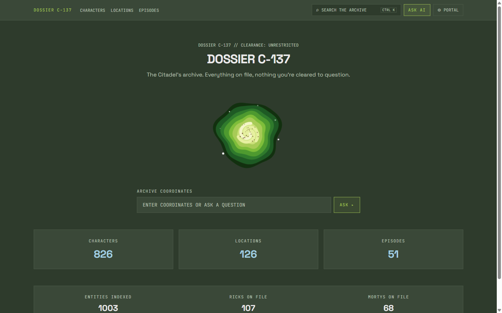
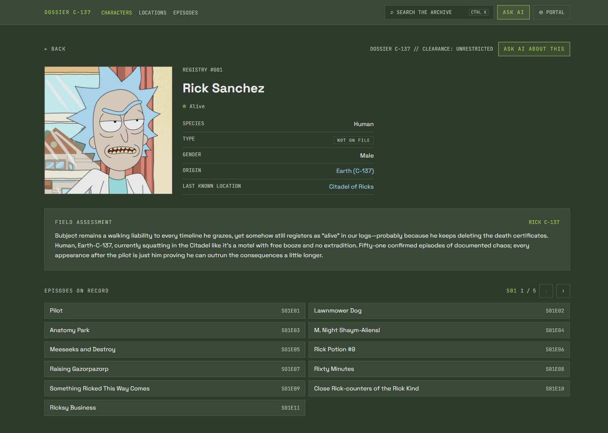
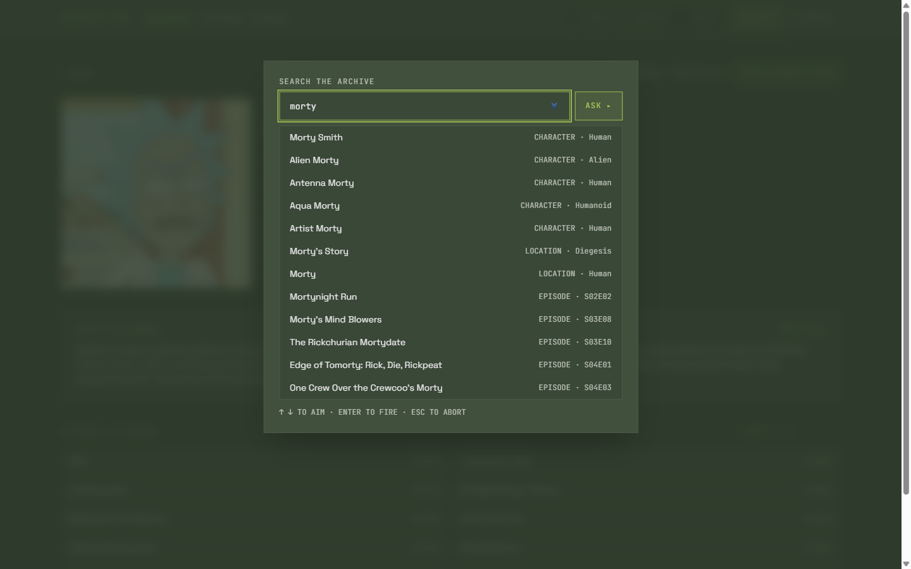
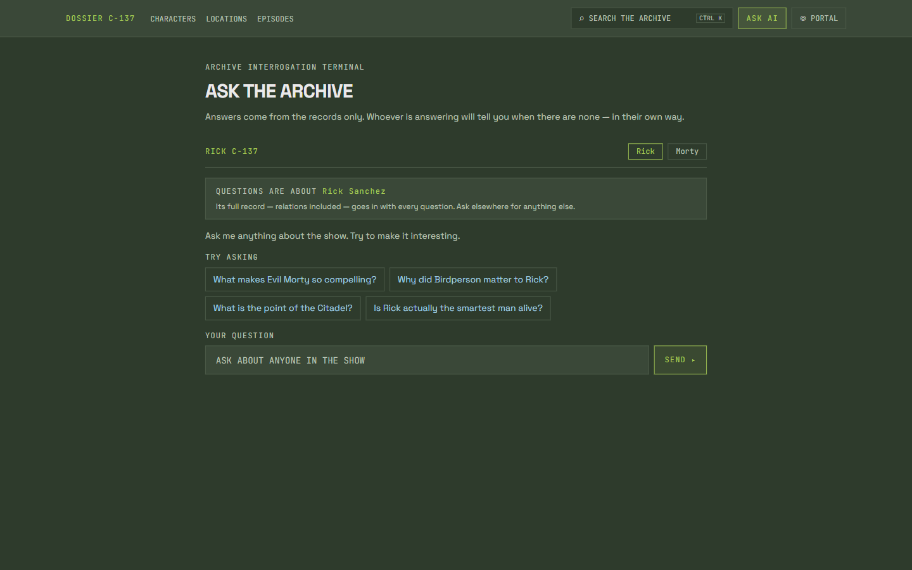
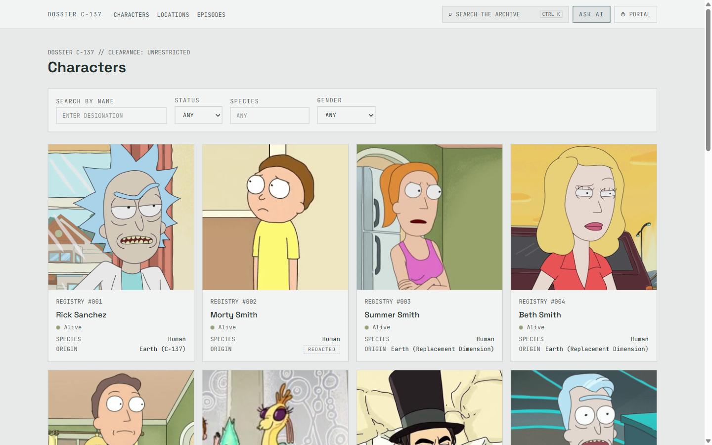

# Dossier C-137

A Rick and Morty archive browser, presented as an internal terminal of the
Citadel of Ricks. Characters, locations and episodes — searchable, cross-linked,
and answerable in Rick's or Morty's voice, with every answer grounded in the
records.

**Live:** https://dossier-c137.vercel.app
**API health:** https://coeupddmmjnjotarlnwg.supabase.co/functions/v1/api/health



| | |
|---|---|
|  |  |
| A character dossier: the record, the generated field assessment, and the episode roll by season | The `⌘K` overlay, searching all three entity types at once |
|  |  |
| The chat, opened from Rick's dossier: it answers about that record, in the voice you pick | The `Citadel` dimension, on the character list — one light, two dark |

## What it does

- **Three sections** — characters, locations, episodes — each with filters, pagination and skeleton loading.
- **Detail pages arrive whole.** A character dossier carries its origin, its last known location and every episode it appears in; the frontend never fans out into a dozen follow-up requests.
- **Search across all three entity types at once**, from `⌘K` / `Ctrl+K`, from the header field, or from the hub.
- **Long rolls are paged, not dumped.** Fifty-one episodes on a dossier become one slide per season, and a hundred residents become pages of eight — arrows on a desktop, an ordinary swipe on a phone, because the track is a real scroll container with snap points.
- **Episodes filter by season** from a chip row, on top of the title and code fields.
- **A back link inside each dossier's own header**, so moving sideways through the archive does not depend on the browser chrome. Every route change starts at the top of the page.
- **A grounded AI chat.** Ask a question in English; the server retrieves real records first and hands the model those records as its authority on the figures. The sources are shown, and they are clickable — the answer cites them inline as `[#47]`, and a number becomes a link only if this answer actually retrieved that record.
- **Every answer closes on three follow-up questions**, rendered as buttons, so a question that went nowhere still offers a way on.
- **`ASK AI ABOUT THIS` carries the open dossier into the chat**, as `?focus=`, and the server resolves that record in full — a character's episodes, a location's residents — ahead of anything search found.
- **The transcript survives a reload**, through `sessionStorage`, with a wipe button; each answer keeps the voice that wrote it.
- **A generated field assessment on every character**, in the voice you chose, written once and stored forever.
- **Three dimensions instead of two themes** — `C-137` (dark), `Citadel` (light), `Cronenberg-1` (dark) — persisted, and applied before first paint so a light-theme visitor never sees a dark flash.
- **The portal transition is the loading indicator.** It lasts exactly as long as the request behind it, as a small badge over a blurred scrim rather than a full-screen takeover.
- **Settings are three tabs** — dimension, AI voice, motion — in a popover anchored to the header, not a column that pushes the page down.

## Every external call happens on the server

The assignment's central requirement. The Rick and Morty API is called only from
`supabase/functions/api/clients/rmClient.ts`, inside the Edge Function. The
browser talks to our own API and nothing else.

This is enforced, not promised. An ESLint rule (`no-restricted-syntax` in
`eslint.config.js`) raises an **error** on the string `rickandmortyapi.com`
anywhere under `src/`, in both string literals and template parts. `npm run
build` does not run ESLint, so the bundle is checked separately — both commands
below are green on the current tree:

```bash
npm run lint                                    # 0 errors
npm run build && grep -r "rickandmortyapi" dist/assets || echo "clean"
```

## Running it locally

```bash
git clone https://github.com/Ba5bit/dossier-c137
cd dossier-c137
npm install
cp .env.example .env.local     # then fill in the values below
npm run dev
```

`.env.local` — frontend, read by Vite. The frontend reads exactly one variable,
`src/shared/api/client.ts:33` being the only `import.meta.env` site in the whole
of `src/`. Anything `VITE_`-prefixed ends up in the browser bundle, so no
provider key ever goes here:

| Variable | What it is |
|---|---|
| `VITE_API_BASE` | The Edge Function base URL, e.g. `https://<ref>.supabase.co/functions/v1/api`. Falls back to `/api` when unset |

No Supabase anon key is needed in the browser: the function is deployed
`--no-verify-jwt`, and the frontend never talks to Supabase directly — only to
the Edge Function.

`supabase/functions/.env` — backend secrets, gitignored, never in the bundle:

| Variable | What it is |
|---|---|
| `XAI_API_KEY` | Grok API key. Without it the archive still works; only the two AI endpoints answer 502 |
| `IP_HASH_SALT` | Salt for the per-caller quota digest. Addresses are hashed, never stored. Falls back to `unsalted-development`, which is fine locally and wrong in production |
| `GROK_MODEL` | Optional. Overrides the default `grok-4-fast-non-reasoning` |
| `SUPABASE_URL`, `SUPABASE_SERVICE_ROLE_KEY` | Injected by the platform at runtime; set neither by hand |

Database and function:

```bash
npx supabase db push                                       # cache_entries, ai_dossiers, ai_usage
npx supabase secrets set --env-file supabase/functions/.env
npx supabase functions deploy api --no-verify-jwt
```

### Commands

| Command | What it does |
|---|---|
| `npm run dev` | Vite dev server |
| `npm test` | Frontend suite (Vitest + RTL + MSW). **Does not type-check** |
| `npm run test:api` | Backend suite (Deno test) |
| `npm run lint` | ESLint, including the API-boundary rule |
| `npm run build` | `tsc -b && vite build` — the only thing that type-checks |

## Architecture

```
Browser ──► Vercel (React SPA)
              │  fetch
              ▼
        Supabase Edge Function  ──►  rickandmortyapi.com
        router → handler → service → client
              │                        ▲
              │  cache / dossiers /    │
              ▼  usage counters        │
        Supabase Postgres ─────────────┘
              ▲
              └── Grok (xAI) for the two AI endpoints
```

**Backend** (`supabase/functions/api/`), eleven endpoints, one layer per concern:

| Endpoint | What it does |
|---|---|
| `GET /health` | liveness |
| `GET /characters`, `/locations`, `/episodes` | filtered, paginated lists |
| `GET /characters/:id`, `/locations/:id`, `/episodes/:id` | a detail with its relations already expanded |
| `GET /stats` | five upstream counts aggregated behind one cache key. Nothing on the hub is hardcoded |
| `GET /search?q=` | three parallel name queries as one cached aggregate |
| `POST /dossier` | write-once character assessment, stored per `(entity, persona, prompt version)` |
| `POST /ask` | grounded answer, streamed as Server-Sent Events |

**Cache.** Every upstream response is stored in Postgres for 24 h, keyed by
sorted parameters. On an upstream failure a stale entry is served rather than an
error, with an `X-Cache: stale` header.

**Frontend** (`src/`): `pages/` compose only, queries live in hooks under
`features/`, and `shared/` knows nothing about specific entity types. Every route
is code-split. All user-facing text lives in `src/shared/lore/copy.ts`.

## Things done differently

**The portal transition is the loader.** A state machine (`usePortalMachine`)
binds the transition to `useIsFetching`, with a 300 ms floor so it never flickers
and an 8 s ceiling so it never hangs. A request that outlives 1.5 s raises a
quote. There is no animation library: CSS keyframes hang off a `data-phase`
attribute and the vortex is a canvas.

**The AI is grounded, not asked nicely.** `/api/ask` resolves the focused record
in full when the question came from a dossier, otherwise it searches the literal
question and widens to extracted terms only if that found nothing, caps at six
records, and hands the model a `CONTEXT` block as its authority on every figure.
The archive is the authority on the numbers, not the boundary of the subject: a
thin record is no longer a reason to refuse a question about the show. Citations
come back as `[#47]` and are rendered as links, but a number becomes a link only
if this answer actually retrieved that record.

**Dossiers are permanent and versioned.** The primary key includes the persona
and a prompt version, so rewording a prompt writes new rows beside the old ones
instead of orphaning them. The daily generation ceiling is spent only when a
dossier is actually written; reading a stored one costs nothing.

**Themes are dimensions.** One light and two dark, applied by an inline script
before first paint. Contrast is not a matter of opinion here: a test parses
`src/index.css` and checks all seven foreground tokens against all three surfaces
in all three dimensions — sixty-three ratios, every one at 4.5:1 or better.

**The boundary is a lint rule**, which turns the assignment's central requirement
into something automatically verified rather than a matter of trust.

## Stack, and what it cost

| Layer | Choice |
|---|---|
| Build / UI | Vite, React 19, TypeScript |
| Routing | React Router v7 (the URL holds all filter state) |
| Data | TanStack Query |
| Styling | Tailwind v4 + CSS custom properties |
| Backend | Supabase Edge Functions (Deno) |
| Storage | Supabase Postgres — cache, dossiers, quota counters |
| Text AI | Grok (xAI) |
| Hosting | Vercel (frontend), Supabase (function) |

**Trade-offs, honestly:**

1. **Vite + Supabase instead of Next.js fullstack.** Gave up SSR, a single deployment and Suspense-native loading. Gained a stack already known well, on a deadline, plus Postgres as a natural cache. Familiarity beat theoretical elegance.
2. **An SPA with no SSR.** First paint is marginally slower and there is nothing for a crawler. Irrelevant for this project.
3. **Grok over Gemini.** A smaller free tier, chosen because tone is the entire point of the feature and Gemini smooths it away.
4. **Postgres as the cache instead of Redis.** Slower, one fewer service. The data is static; the difference is immaterial.
5. **Two deployments instead of one.** Accepted deliberately, for the same reason as (1).
6. **No animation library.** The state machine already owns every duration, so Framer Motion would have been 50 kB for CSS that already existed.

## Known issues

- **There is no audio at all.** Dossiers are read, not narrated, and the portal fires silently — the synthesized whoosh and its setting were removed rather than left as a toggle nobody wanted. A second paid provider with its own quota and failure modes was not worth a button nobody grades; the AI bonus is carried by the grounded chat and the dossiers, which are the parts that show retrieval and prompt work. The specification still lists ElevenLabs under its stack — the README is the accurate document.
- **Edge Function cold starts** add 200–500 ms to the first request after an idle period. The portal transition absorbs it, but a cold first load is visibly slower.
- **AI daily quotas.** 30 questions and 10 dossier generations per caller per day, plus a global ceiling of 500. Exhausting one returns a portal-gun-out-of-fluid message, not an error page.
- **No SSR**, so the first paint waits for JavaScript.
- **The first `Ctrl+K` after typing a URL** can be swallowed by the browser's address bar, which still holds focus. Click once in the page, or use the header's search field. The listener itself is attached above every lazy route boundary — there is a test for that.
- **The AI voices can converge over a long conversation.** Each question carries the last six turns back to the model, and a model reads its own earlier prose as a style guide. The prompt now forbids imitating an earlier turn, and on a fresh question the two are plainly distinct — Rick opens "Who cares, another Birdperson," Morty opens "Aw jeez, um…" — but the pull is still there deep into a thread. Switching voice mid-conversation is the workaround.
- **Half of all origins are `unknown`** upstream. A `REDACTED` chip is a routine field state here, not a flourish; a value the archive never held reads `NOT ON FILE` instead.
- **Route changes give up the browser's scroll restoration.** Going back to a list returns you to its top rather than to the row you left — deliberate, because arriving mid-page reads as a broken render.

## Testing

475 tests: 307 on the frontend under Vitest with React Testing Library and MSW,
168 on the backend under Deno test against stubbed clients. Both suites, the
build and the lint pass on `main` as published — `npm run lint` reports 0 errors
and 15 `react-refresh/only-export-components` warnings, all of them on files that
export a constant beside the component.

Effort concentrates on branching logic rather than markup: filter parsing, cache
keys, relation expansion, the portal state machine, season grouping and the
carousel pager, the follow-up parser, retrieval and grounding, quota accounting, and
the contrast grid. `npm test` does not type-check — Vitest
transpiles without checking — so `npm run build` is part of every verification.

## How it was built

Design first, code second. The requirements went through a brainstorm, then a
full written specification, then five implementation plans, each executed
test-first with the tests written before the code.

| Document | What it settles |
|---|---|
| [`docs/superpowers/specs/2026-08-19-dossier-c137-design.md`](docs/superpowers/specs/2026-08-19-dossier-c137-design.md) | The whole design, with a table mapping every assignment requirement to a section |
| [`docs/superpowers/plans/`](docs/superpowers/plans/) | Five plans: foundation, entities, portal, AI, polish |
| [`docs/design/tokens.md`](docs/design/tokens.md) | Ten source colours, three palettes, every pair contrast-checked |
| [`docs/design/visual-direction.md`](docs/design/visual-direction.md) | The direction taken, the alternatives rejected, and why |
| [`docs/superpowers/design-review-remaining.md`](docs/superpowers/design-review-remaining.md) | The design review: every finding, and the commit that closed it |
